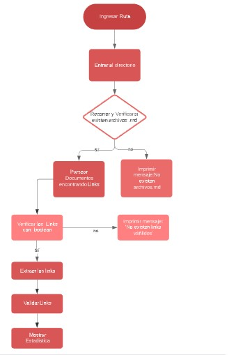
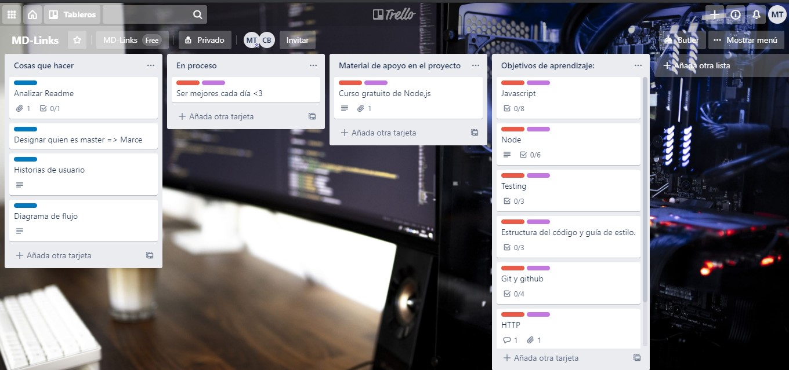
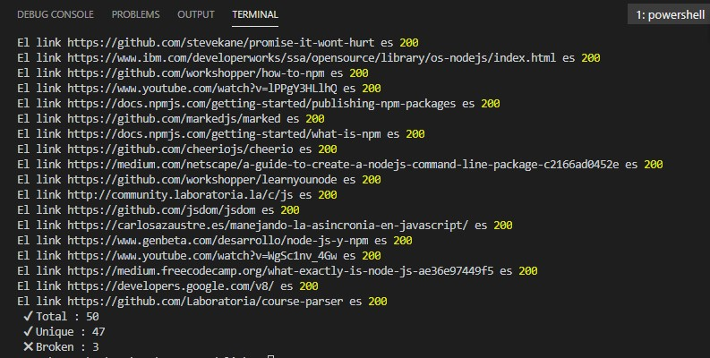

# CM-MD Links
## Índice
* [1. Preámbulo](#1-preámbulo)
* [2. Diagrama de Flujo](#2-diagrama-de-flujo)
* [3. Backlog para la implementación de la librería](#3-backlog-para-la-implementación-de-la-librería)
* [4. USO](#4-uso)
* [5. Links de prueba](#5-links-de-prueba)
* [6. Autores](#6-autores)
***

***
## 1. Preámbulo
[Markdown](https://es.wikipedia.org/wiki/Markdown) es un lenguaje de marcado
ligero muy popular entre developers. Es usado en muchísimas plataformas que
manejan texto plano (GitHub, foros, blogs, ...), y es muy común
encontrar varios archivos en ese formato en cualquier tipo de repositorio
(empezando por el tradicional `README.md`).
Estos archivos `Markdown` normalmente contienen _links_ (vínculos/ligas) que
muchas veces están rotos o ya no son válidos y eso perjudica mucho el valor de
la información que se quiere compartir.
Dentro de una comunidad de código abierto, nos han propuesto crear una
herramienta usando [Node.js](https://nodejs.org/), que lea y analice archivos
en formato `Markdown`, para verificar los links que contengan y reportar
algunas estadísticas.
### Objetivo del proyecto
El programa funciona como una librería npm. El algoritmo realiza operaciones como: identificar ruta, convertirla en ruta absoluta, leer archivos, identificar y validar links.
Es un programa que muestra lo que hay dentro de un 'archivo .md', tanto los enlaces válidos, como los enlaces con error.
***
## 2. Diagrama de Flujo
* A traves del diagrama de flujo se observa la lógica de la librería.
[DIAGRAMA](https://app.lucidchart.com/invitations/accept/89671d05-cf9b-4476-b1d8-f8456722dd78)

***
## 3. Backlog para la implementación de la librería
* Se creó en TRELLO la organización y planificación del mismo, haciendo uso de objetivo de aprendizaje (por sprint), listas para asignar tareas por funciones y dentro de cada una un checklist con tareas más pequeñas.
También se encuentran links de aprendizajes sobre NODE.JS y librerías.

[TRELLO](https://trello.com/b/tK9EOUan/md-links)
***
## 4. USO
* Para acceder se tiene que ingresar al sitio de npm y buscar "cm-md-links".
* Para instalar ingrese npm i cm-md-links.
* Copie el código que se encuentra en el archivo index.js.
* Para que ejecute ingrese en la terminal >>  node nombre de carpeta ruta del archivo (donde están los archivos .md)
Ejemplo : node index.js ./README.md
Al "apretar enter" se imprimira un listado con el link del archivo , su texto y ruta.
Además de el estado del link

## 5. Links de prueba
[BUENO](https://google.com)
[BUENO](https://github.com/Marce-8888)
[MALO](https://github.com/marc45j)
[MALO](https://github.com/camiii7t?i)
## 6. Autores
* Camila García
* Marcela Tancara
